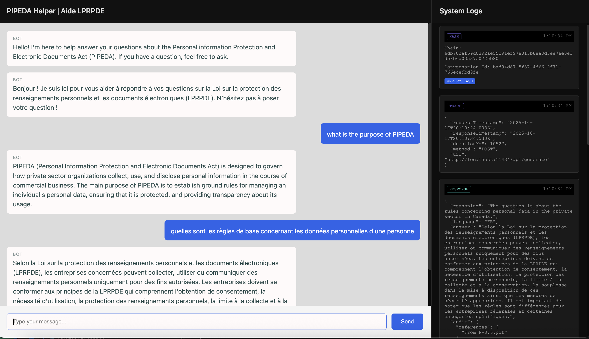

# SATI - Stateless Audit Trail Inference

LLMs are stateless. REST is stateless. SATI is a protocol that makes LLM conversations work like REST resources.

**Treat LLM interactions like HTTP requests**—every call is logged, timestamped, and verifiable. This unlocks standard web tooling: Prometheus monitoring, OpenTelemetry tracing, API gateways, and the DevOps stack you already use.


Chat interface on the left. Full observability on the right.

## What SATI enables
- **Stateless reconstruction** - no session store, conversations rebuilt from immutable records
- **Tamper-proof history** - blockchain-style chain hashing for integrity
- **Structured reasoning** - see what the AI was thinking, not just what it said

Observe, audit, and verify every LLM interaction using standard HTTP/REST patterns.

## Quick Start 

**Local (Ollama):**
```bash
# Node.js
ollama pull mistral
cd nodejs && npm install && node server.js

# .NET
cd dotnet && dotnet run
```

**Cloud APIs (OpenAI/Anthropic):**
Edit [config.json](config/config.json) with your provider and API key, then run.

Both run on `http://localhost:3000` with identical UI. 


**Core Benefits:**
- **Provider independence** - Switch from OpenAI to Anthropic to local models by without refactoring
- **Observability as infrastructure** - Monitor LLMs like you monitor REST APIs
- **Compliance-ready audit trails** - Cryptographic chain proves what the AI said (legal/medical/financial)
- **Stateless by design** - Replay any turn with full context, no session state to manage.
- **Prompt injection resilience** - Instructions regenerated per turn, not hijacked

**Who This Is For:**

*Developers prototyping AI features* - Ship in hours using local models, migrate to cloud APIs later without changing middleware. Drop in your files, modify instructions and run it.

*Platform teams* - Vendor-neutral telemetry, request/response tracing, and policy enforcement at the HTTP layer.

*Regulated industries* - Tamper-evident audit logs work identically whether you're using Azure, OpenAI or self-hosted models.

Full technical deep-dive: [pattern.md](./docs/pattern.md)

## This is a Pattern, Not a Product

SATI demonstrates that LLM middleware can be done simply with HTTP.

**This is intentionally minimal.** Each abstraction is intentionally modular so it can be improved.
- Swap in production-grade RAG (vector databases, reranking)
- Upgrade hashing (HMAC, HSM integration)
- Add policy layers (rate limiting, content filtering)
- Implement auth (OAuth, API keys, mTLS)

Every interaction is HTTP, so standard web patterns just work: OpenTelemetry tracing, API gateways, load balancers, CDN caching.
Fork it. Build with it. Make it yours.

## License
MIT

## Context
Submitted to the ISED Canada AI National Sprint as a demonstration of HTTP-native patterns for observable, auditable LLM systems.